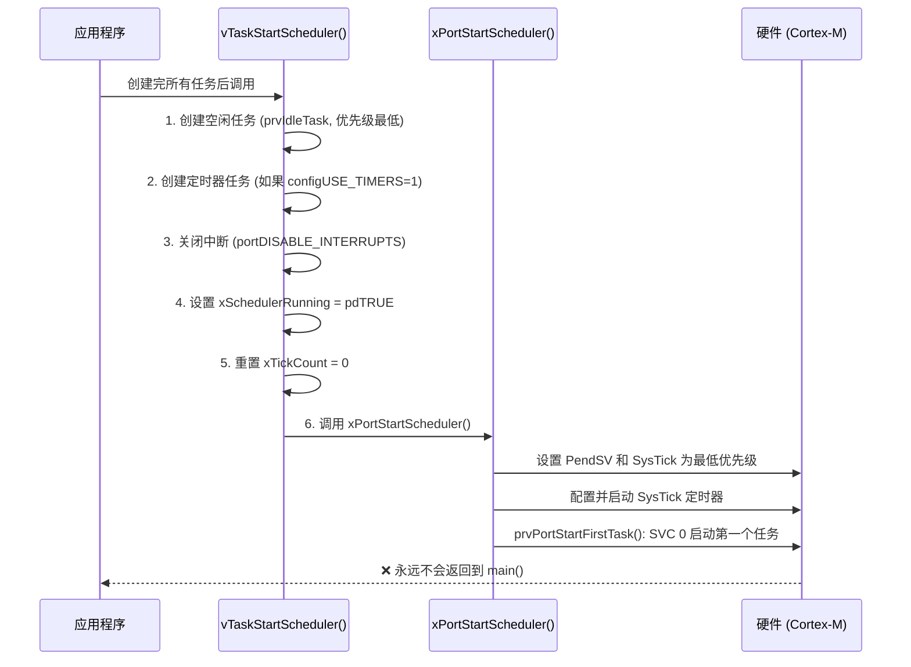
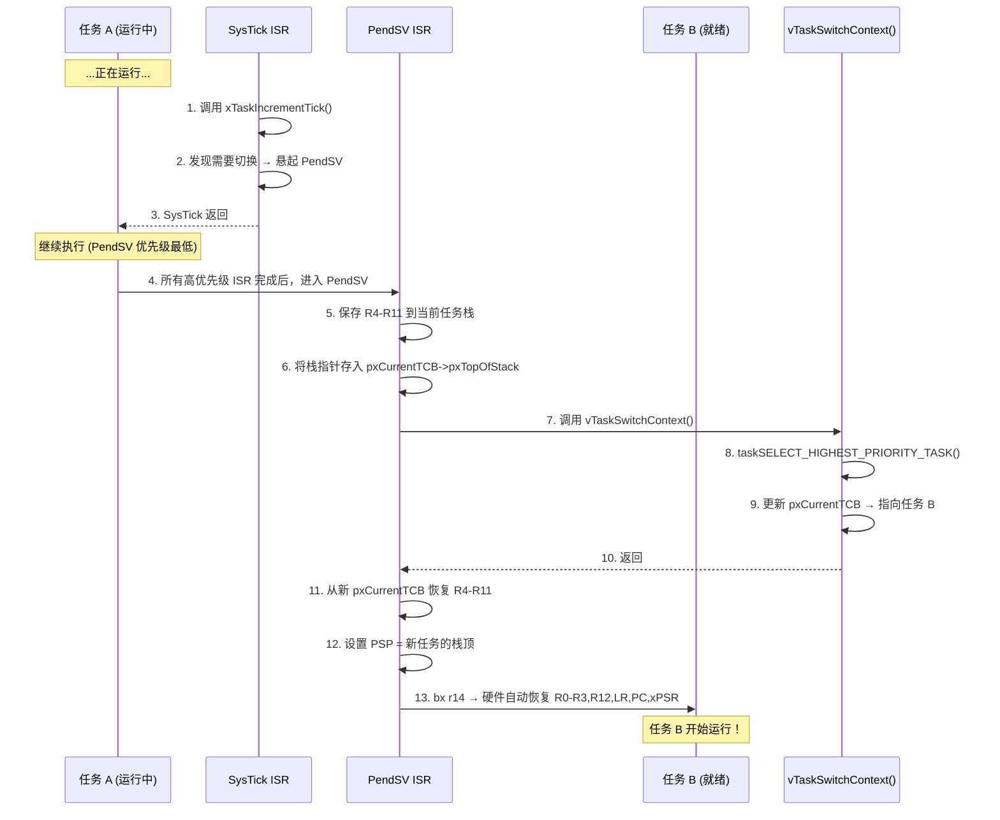
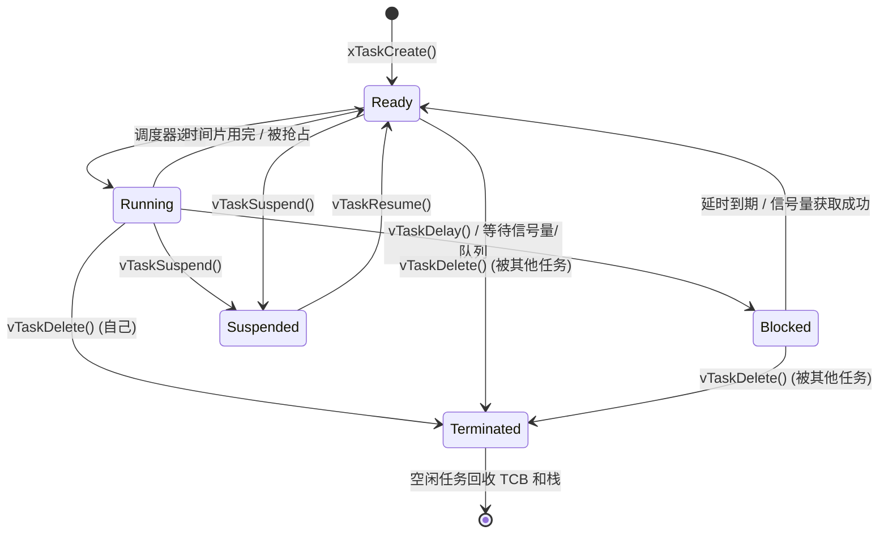
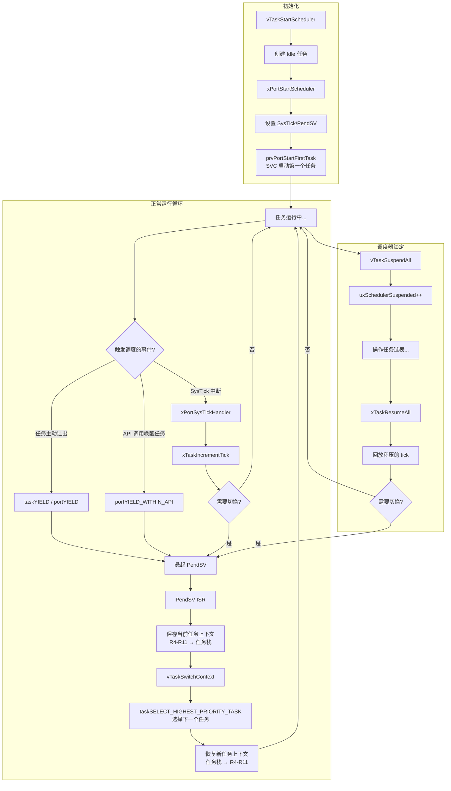

# FreeRTOS 任务调度机制深度解析

> 基于 FreeRTOS V9.0.0 源码分析 | ARM Cortex-M3 (GCC) 移植

---

## 目录

1. [总体架构](#1-总体架构)
2. [核心数据结构](#2-核心数据结构)
3. [调度器启动流程](#3-调度器启动流程)
4. [任务选择算法](#4-任务选择算法)
5. [上下文切换机制](#5-上下文切换机制)
6. [Tick 中断与时间管理](#6-tick-中断与时间管理)
7. [抢占调度](#7-抢占调度)
8. [时间片轮转](#8-时间片轮转)
9. [临界区与调度器锁定](#9-临界区与调度器锁定)
10. [任务状态转换](#10-任务状态转换)
11. [完整调度流程图](#11-完整调度流程图)
12. [关键源码索引](#12-关键源码索引)

---

## 1. 总体架构

FreeRTOS 采用**基于优先级的多级就绪队列 + 时间片轮转**的混合调度策略：

```
┌─────────────────────────────────────────────────────┐
│                  FreeRTOS 调度器                      │
│                                                     │
│  调度策略: 优先级抢占式 (Preemptive Priority)         │
│  同优先级: 时间片轮转 (Round-Robin Time Slicing)      │
│  调度时机: Tick中断 / 主动让出 / 中断返回             │
│  上下文切换: PendSV异常 (ARM Cortex-M)                │
└─────────────────────────────────────────────────────┘
```

### 调度器类型

| 配置宏 | 行为 |
|--------|------|
| `configUSE_PREEMPTION = 1` | **抢占式调度** — 高优先级任务就绪时立即抢占低优先级任务 |
| `configUSE_PREEMPTION = 0` | **合作式调度** — 任务必须主动调用 `taskYIELD()` 才会切换 |
| `configUSE_TIME_SLICING = 1` | 同优先级任务按时间片轮转（仅抢占模式下有效） |
| `configUSE_TIME_SLICING = 0` | 同优先级任务不自动轮转，需手动 `taskYIELD()` |

---

## 2. 核心数据结构

### 2.1 任务控制块 (TCB)

每个任务有一个 TCB，存储该任务的所有上下文信息（`tasks.c:244-310`）：

```c
typedef struct tskTaskControlBlock
{
    // ⭐ 第一个成员：栈顶指针（必须放在第一位，PendSV 汇编中直接通过偏移访问）
    volatile StackType_t *pxTopOfStack;

    // 状态链表项 — 用于将 TCB 挂在 Ready/Blocked/Suspended 链表上
    ListItem_t xStateListItem;

    // 事件链表项 — 用于将 TCB 挂在事件链表上（如信号量等待队列）
    ListItem_t xEventListItem;

    // 任务优先级 (0 = 最低优先级)
    UBaseType_t uxPriority;

    // 栈起始地址
    StackType_t *pxStack;

    // 任务名称（调试用）
    char pcTaskName[configMAX_TASK_NAME_LEN];

    // 优先级继承相关（互斥量）
    #if (configUSE_MUTEXES == 1)
        UBaseType_t uxBasePriority;   // 原始优先级
        UBaseType_t uxMutexesHeld;
    #endif

    // 运行时间统计
    #if (configGENERATE_RUN_TIME_STATS == 1)
        uint32_t ulRunTimeCounter;
    #endif

    // 任务通知
    #if (configUSE_TASK_NOTIFICATIONS == 1)
        volatile uint32_t ulNotifiedValue;
        volatile uint8_t ucNotifyState;
    #endif

    // ... 更多可选成员
} TCB_t;
```

### 2.2 就绪任务链表数组

这是 FreeRTOS 调度器的**核心数据结构**（`tasks.c:403`）：

```c
/* 每个优先级一个就绪链表，configMAX_PRIORITIES 默认为 5 */
PRIVILEGED_DATA static List_t pxReadyTasksLists[configMAX_PRIORITIES];
```

```
 pxReadyTasksLists:
 ┌─────────────────┐
 │ [优先级 4]      │ → TCB_A → TCB_B → TCB_C  (高优先级)
 ├─────────────────┤
 │ [优先级 3]      │ → (空)
 ├─────────────────┤
 │ [优先级 2]      │ → TCB_D → TCB_E
 ├─────────────────┤
 │ [优先级 1]      │ → (空)
 ├─────────────────┤
 │ [优先级 0]      │ → IDLE_TCB              (低优先级，idle任务)
 └─────────────────┘
```

### 2.3 全局关键变量

| 变量 | 类型 | 说明 | 定义位置 |
|------|------|------|----------|
| `pxCurrentTCB` | `TCB_t *` | 当前正在运行的任务 | `tasks.c:373` |
| `pxReadyTasksLists[]` | `List_t[]` | 就绪链表数组（每个优先级一个） | `tasks.c:403` |
| `pxDelayedTaskList` | `List_t *` | 当前使用的延时任务链表 | `tasks.c:416` |
| `pxOverflowDelayedTaskList` | `List_t *` | 溢出延时任务链表 | `tasks.c:417` |
| `xPendingReadyList` | `List_t` | 挂起就绪链表（调度器锁定时使用） | `tasks.c:425` |
| `xSuspendedTaskList` | `List_t` | 挂起任务链表 | `tasks.c` |
| `uxSchedulerSuspended` | `UBaseType_t` | 调度器锁定计数 | `tasks.c:372` |
| `xTickCount` | `TickType_t` | 系统 tick 计数器 | `tasks.c:378` |
| `xNextTaskUnblockTime` | `TickType_t` | 下一个任务解阻塞的时刻 | `tasks.c:421` |
| `uxTopReadyPriority` | `UBaseType_t` | 当前最高就绪优先级 | `tasks.c:382` |
| `uxCurrentNumberOfTasks` | `UBaseType_t` | 当前任务总数 | `tasks.c:376` |
| `xYieldPending` | `BaseType_t` | 是否有待处理的调度请求 | `tasks.c:374` |

### 2.4 链表操作 (list.c)

FreeRTOS 的双向链表是实现所有调度逻辑的基石：

```c
// 链表结构
typedef struct xLIST {
    UBaseType_t uxNumberOfItems;    // 链表中的项数
    ListItem_t *pxIndex;            // 用于遍历链表的索引指针
    MiniListItem_t xListEnd;        // 链表尾标记（xItemValue = portMAX_DELAY）
} List_t;

// 链表项结构
struct xLIST_ITEM {
    TickType_t xItemValue;          // 排序依据值（用于延时排序/优先级排序）
    struct xLIST_ITEM *pxNext;      // 下一个
    struct xLIST_ITEM *pxPrevious;  // 上一个
    void *pvOwner;                  // 指向所属 TCB
    void *pvContainer;              // 指向所属链表
};
```

**关键操作**：
- `vListInsert()` — 按 `xItemValue` **升序**插入（值小的在前）
- `vListInsertEnd()` — 插入到 `pxIndex` 之前（用于就绪链表，实现 FIFO）
- `listGET_OWNER_OF_NEXT_ENTRY()` — 获取 `pxIndex` 指向的下一个项的 owner，并**推进 pxIndex**（实现轮转）

---

## 3. 调度器启动流程

`vTaskStartScheduler()` 是 FreeRTOS 的入口函数（`tasks.c:1826`）：



**关键源码解析**（`tasks.c:1826-1906`）：

```c
void vTaskStartScheduler(void) {
    // ① 创建空闲任务 (优先级 tskIDLE_PRIORITY = 0，最低)
    xReturn = xTaskCreate(prvIdleTask, "IDLE", configMINIMAL_STACK_SIZE,
                          NULL, tskIDLE_PRIORITY | portPRIVILEGE_BIT, &xIdleTaskHandle);

    // ② 创建软件定时器任务
    #if (configUSE_TIMERS == 1)
        xReturn = xTimerCreateTimerTask();
    #endif

    if (xReturn == pdPASS) {
        portDISABLE_INTERRUPTS();           // 临界操作，关中断
        xNextTaskUnblockTime = portMAX_DELAY;
        xSchedulerRunning = pdTRUE;         // ⭐ 标记调度器已启动
        xTickCount = 0;

        // ③ 进入硬件移植层，永不返回
        xPortStartScheduler();
    }
}
```

**`xPortStartScheduler()` 做了什么**（`ARM_CM3/port.c:288`）：

1. 设置 PendSV 和 SysTick 为**最低中断优先级**
2. 调用 `vPortSetupTimerInterrupt()` 配置硬件定时器产生 tick
3. 调用 `prvPortStartFirstTask()` — 汇编函数，触发 SVC 0 异常启动第一个任务

---

## 4. 任务选择算法

### 4.1 通用方法 (`configUSE_PORT_OPTIMISED_TASK_SELECTION = 0`)

通过 `uxTopReadyPriority` 变量跟踪最高就绪优先级，从高到低遍历（`tasks.c`）：

```c
#define taskSELECT_HIGHEST_PRIORITY_TASK()                          \
{                                                                    \
    UBaseType_t uxTopPriority = uxTopReadyPriority;                  \
    /* 从最高优先级向下找到第一个非空的就绪链表 */                     \
    while(listLIST_IS_EMPTY(&(pxReadyTasksLists[uxTopPriority])))    \
    {                                                                \
        --uxTopPriority;                                             \
    }                                                                \
    /* 从该链表中轮转获取下一个任务（同优先级公平调度）*/               \
    listGET_OWNER_OF_NEXT_ENTRY(pxCurrentTCB,                        \
        &(pxReadyTasksLists[uxTopPriority]));                        \
    uxTopReadyPriority = uxTopPriority;                              \
}
```

> 时间复杂度：O(N)，N = 优先级数量

### 4.2 硬件优化方法 (`configUSE_PORT_OPTIMISED_TASK_SELECTION = 1`)

利用 ARM Cortex-M 的 `CLZ`（Count Leading Zeros）指令实现 **O(1)** 优先级查找：

```c
// portmacro.h 中的优化实现
#define portGET_HIGHEST_PRIORITY(uxTopPriority, uxTopReadyPriority)  \
{                                                                    \
    /* 32个优先级一组，用位图表示各优先级是否有就绪任务 */              \
    /* CLZ 指令直接定位最高优先级的非空位 */                           \
    uxTopPriority = (31UL - __clz(uxTopReadyPriority));              \
}
```

对比：

| 方法 | 时间复杂度 | 适用场景 |
|------|-----------|---------|
| 通用方法 | O(N) | 优先级数较少或需要兼容性 |
| 硬件优化 | O(1) | ARM Cortex-M 系列（有 CLZ 指令） |

### 4.3 就绪优先级追踪宏

```c
// 当任务加入就绪链表时更新最高优先级
#define taskRECORD_READY_PRIORITY(uxPriority)                       \
{                                                                    \
    if((uxPriority) > uxTopReadyPriority)                            \
    {                                                                \
        uxTopReadyPriority = (uxPriority);                           \
    }                                                                \
}

// 当就绪链表的最后一个任务被移除时，需要重新计算最高优先级
#define taskRESET_READY_PRIORITY(uxPriority)                        \
{                                                                    \
    if(listCURRENT_LIST_LENGTH(&(pxReadyTasksLists[(uxPriority)]))  \
       == (UBaseType_t)0)                                           \
    {                                                                \
        portRESET_READY_PRIORITY((uxPriority), (uxTopReadyPriority));\
    }                                                                \
}
```

---

## 5. 上下文切换机制

FreeRTOS 在 ARM Cortex-M 上利用 **PendSV 异常** 实现上下文切换：

```
为什么用 PendSV？
├─ PendSV 可以配置为最低优先级异常
├─ 确保所有高优先级 ISR 执行完毕后才切换任务
├─ 避免在 ISR 中直接切换导致的中断延迟问题
└─ 通过 "悬起" 机制实现延迟切换
```

### 5.1 上下文切换流程



### 5.2 PendSV 汇编代码逐行解析

来自 `ARM_CM3/port.c:399`：

```asm
xPortPendSVHandler:
    mrs r0, psp                     ; ① 读取当前任务的进程栈指针 (PSP)
    isb
    ldr r3, pxCurrentTCBConst       ; ② 加载 pxCurrentTCB 变量的地址
    ldr r2, [r3]                    ; ③ 加载 pxCurrentTCB 的值 (即 TCB 指针)
    stmdb r0!, {r4-r11}             ; ④ 将 R4-R11 压入任务栈 (R0-R3,R12,LR,PC,xPSR 已由硬件自动入栈)
    str r0, [r2]                    ; ⑤ 将新栈顶保存到 TCB->pxTopOfStack
    stmdb sp!, {r3, r14}            ; ⑥ 保存 R3(TCB指针地址) 和 LR 到主栈
    mov r0, #configMAX_SYSCALL_...  ; ⑦ 临时提高中断屏蔽阈值
    msr basepri, r0
    bl vTaskSwitchContext           ; ⑧ ⭐ 调用 C 函数选择下一个任务
    mov r0, #0                      ; ⑨ 解除中断屏蔽
    msr basepri, r0
    ldmia sp!, {r3, r14}            ; ⑩ 恢复 R3 和 LR
    ldr r1, [r3]                    ; ⑪ 加载新的 pxCurrentTCB 值
    ldr r0, [r1]                    ; ⑫ 加载新任务的栈顶指针
    ldmia r0!, {r4-r11}             ; ⑬ 从新栈恢复 R4-R11
    msr psp, r0                     ; ⑭ 设置 PSP 为新任务栈顶
    isb
    bx r14                          ; ⑮ 异常返回 → 硬件自动恢复 R0-R3,R12,LR,PC,xPSR

    .align 4
pxCurrentTCBConst: .word pxCurrentTCB
```

### 5.3 vTaskSwitchContext() 详解

`tasks.c:2761`：

```c
void vTaskSwitchContext(void) {
    if (uxSchedulerSuspended != pdFALSE) {
        // 调度器被锁定，设置待处理标志，等解锁后再切换
        xYieldPending = pdTRUE;
    } else {
        xYieldPending = pdFALSE;

        // ① 累计运行时间统计
        #if (configGENERATE_RUN_TIME_STATS == 1)
            pxCurrentTCB->ulRunTimeCounter += (当前时间 - 切入时间);
        #endif

        // ② 检查栈溢出
        taskCHECK_FOR_STACK_OVERFLOW();

        // ③ ⭐ 核心：选择最高优先级就绪任务
        taskSELECT_HIGHEST_PRIORITY_TASK();

        // ④ 更新 Newlib 重入结构指针
        #if (configUSE_NEWLIB_REENTRANT == 1)
            _impure_ptr = &(pxCurrentTCB->xNewLib_reent);
        #endif
    }
}
```

---

## 6. Tick 中断与时间管理

### 6.1 SysTick 中断处理

`ARM_CM3/port.c:440`：

```c
void xPortSysTickHandler(void) {
    portDISABLE_INTERRUPTS();
    {
        // 调用内核 tick 处理函数
        if (xTaskIncrementTick() != pdFALSE) {
            // 需要上下文切换 → 悬起 PendSV
            portNVIC_INT_CTRL_REG = portNVIC_PENDSVSET_BIT;
        }
    }
    portENABLE_INTERRUPTS();
}
```

### 6.2 xTaskIncrementTick() 核心逻辑

`tasks.c:2499`：

```c
BaseType_t xTaskIncrementTick(void) {
    BaseType_t xSwitchRequired = pdFALSE;

    if (uxSchedulerSuspended == pdFALSE) {
        // ① 递增 tick 计数
        xTickCount++;

        // ② tick 溢出时交换延时链表
        if (xTickCount == 0) {
            taskSWITCH_DELAYED_LISTS();
        }

        // ③ 检查是否有任务超时需要唤醒
        if (xTickCount >= xNextTaskUnblockTime) {
            for (;;) {
                if (延时链表为空) break;

                pxTCB = 链表头部的任务;
                if (xTickCount < 该任务的唤醒时间) {
                    // 还没到时间，更新下次检查时间
                    xNextTaskUnblockTime = 该任务唤醒时间;
                    break;
                }

                // 时间到了！将任务从延时链表移到就绪链表
                uxListRemove(&(pxTCB->xStateListItem));
                if (在事件链表上) uxListRemove(&(pxTCB->xEventListItem));
                prvAddTaskToReadyList(pxTCB);

                // 如果唤醒的任务优先级 >= 当前任务，需要切换
                #if (configUSE_PREEMPTION == 1)
                    if (pxTCB->uxPriority >= pxCurrentTCB->uxPriority) {
                        xSwitchRequired = pdTRUE;
                    }
                #endif
            }
        }

        // ④ 时间片轮转检查
        #if ((configUSE_PREEMPTION == 1) && (configUSE_TIME_SLICING == 1))
            if (同优先级就绪链表中有 > 1 个任务) {
                xSwitchRequired = pdTRUE;  // 触发时间片轮转
            }
        #endif
    } else {
        // 调度器锁定中，累积待处理的 tick
        uxPendedTicks++;
    }

    return xSwitchRequired;
}
```

### 6.3 延时链表设计

FreeRTOS 用**两个延时链表**解决 tick 溢出的问题：

```
正常情况 (tick 未溢出):
  pxDelayedTaskList       → 当前活跃的延时链表
  pxOverflowDelayedTaskList → 空，等待接收溢出任务

tick 计数溢出到 0 时:
  taskSWITCH_DELAYED_LISTS() — 交换两个链表指针
  (原来在 pxDelayedTaskList 中的任务都变成了"过期"任务，会被逐步唤醒)
```

延时链表按**唤醒时刻** (`xItemValue = 唤醒时的 tick 值`) 升序排列，所以只需要检查链表头部的任务是否到期。

---

## 7. 抢占调度

### 7.1 抢占触发条件

| 场景 | 触发方式 | 源码位置 |
|------|---------|---------|
| Tick 中断发现更高优先级任务就绪 | SysTick → `xTaskIncrementTick()` 返回 `pdTRUE` | `port.c:448` |
| ISR 中释放信号量唤醒高优先级任务 | `portYIELD_FROM_ISR()` → 悬起 PendSV | `portmacro.h` |
| 任务优先级被提高 | `vTaskPrioritySet()` → `taskYIELD_IF_USING_PREEMPTION()` | `tasks.c` |
| 调度器解锁时有待处理切换 | `xTaskResumeAll()` → `taskYIELD_IF_USING_PREEMPTION()` | `tasks.c:2017` |

### 7.2 抢占宏定义

```c
#if (configUSE_PREEMPTION == 1)
    #define taskYIELD_IF_USING_PREEMPTION()  portYIELD_WITHIN_API()
#else
    #define taskYIELD_IF_USING_PREEMPTION()  // 空：合作式不自动切换
#endif

// portYIELD_WITHIN_API 通常定义为：
#define portYIELD_WITHIN_API()  portYIELD()

// portYIELD() → 悬起 PendSV
#define portYIELD()  portNVIC_INT_CTRL_REG = portNVIC_PENDSVSET_BIT
```

---

## 8. 时间片轮转

### 8.1 轮转机制

当多个任务具有**相同优先级**时，FreeRTOS 通过链表索引轮转实现公平调度：

```c
// 关键宏 (tasks.c)
#define listGET_OWNER_OF_NEXT_ENTRY(pxTCB, pxList)                    \
{                                                                      \
    List_t *const pxConstList = (pxList);                              \
    /* 将 pxIndex 移动到下一个节点 */                                    \
    pxConstList->pxIndex = pxConstList->pxIndex->pxNext;               \
    /* 如果到了链表尾，跳到真正的第一个节点 */                             \
    if (pxConstList->pxIndex == (ListItem_t *)&(pxConstList->xListEnd))\
    {                                                                   \
        pxConstList->pxIndex = pxConstList->pxIndex->pxNext;            \
    }                                                                   \
    /* 获取该节点的 owner (即 TCB) */                                    \
    (pxTCB) = pxConstList->pxIndex->pvOwner;                            \
}
```

**原理**：`pxIndex` 像一个旋转的指针，每次选择任务后向前移动一步，循环遍历同优先级的所有任务。

```
时间片轮转示意:
 ┌──── pxIndex
 ↓
[A] → [B] → [C] → [END] ─┐
 ↑                        │
 └────────────────────────┘

Tick 1: pxIndex→A 执行, 下次 pxIndex→B
Tick 2: pxIndex→B 执行, 下次 pxIndex→C
Tick 3: pxIndex→C 执行, 下次 pxIndex→A
```

### 8.2 空闲任务的特殊处理

`prvIdleTask`（`tasks.c:3131`）：

```c
static portTASK_FUNCTION(prvIdleTask, pvParameters) {
    for (;;) {
        // ① 清理已删除的任务
        prvCheckTasksWaitingTermination();

        #if (configUSE_PREEMPTION == 0)
            // 合作式：主动让出 CPU
            taskYIELD();
        #endif

        #if ((configUSE_PREEMPTION == 1) && (configIDLE_SHOULD_YIELD == 1))
            // 抢占式：如果有同优先级的用户任务，主动让出
            if (同优先级就绪链表长度 > 1) {
                taskYIELD();
            }
        #endif
    }
}
```

---

## 9. 临界区与调度器锁定

FreeRTOS 提供**两种级别的保护机制**：

### 9.1 临界区 (Critical Section)

```c
taskENTER_CRITICAL();   // 关闭中断 + 嵌套计数++
// ... 受保护的代码 ...
taskEXIT_CRITICAL();    // 嵌套计数--，计数为 0 时开中断
```

- **特点**: 禁止所有中断（包括 SysTick）
- **用途**: 保护极短的关键代码（微秒级）
- **不能使用**: 会导致任务阻塞的 API

### 9.2 调度器锁定 (Scheduler Suspension)

```c
vTaskSuspendAll();      // uxSchedulerSuspended++
// ... 可安全操作任务链表 ...
xTaskResumeAll();       // uxSchedulerSuspended--, 为 0 时处理积压的 tick
```

- **特点**: 允许中断，但禁止任务切换
- **用途**: 保护较长的原子操作（毫秒级）
- **可以调用**: 部分 FreeRTOS API

### 9.3 xTaskResumeAll() 详解

`tasks.c:2017`：

```c
BaseType_t xTaskResumeAll(void) {
    --uxSchedulerSuspended;

    if (uxSchedulerSuspended == 0) {
        // ① 将挂起就绪链表中的任务移入正式就绪链表
        while (!listLIST_IS_EMPTY(&xPendingReadyList)) {
            pxTCB = 取出一个任务;
            prvAddTaskToReadyList(pxTCB);
            if (pxTCB->uxPriority >= pxCurrentTCB->uxPriority) {
                xYieldPending = pdTRUE;
            }
        }

        // ② 回放积压的 tick（调度器锁定期间错过的 tick）
        while (uxPendedTicks > 0) {
            if (xTaskIncrementTick() != pdFALSE) {
                xYieldPending = pdTRUE;
            }
            uxPendedTicks--;
        }

        // ③ 如果有待处理切换，现在执行
        if (xYieldPending != pdFALSE) {
            taskYIELD_IF_USING_PREEMPTION();
        }
    }
}
```

---

## 10. 任务状态转换



### 状态对应的链表

| 状态 | 所在链表 | 如何标记 |
|------|---------|---------|
| **Ready** | `pxReadyTasksLists[优先级]` | `xStateListItem` 挂在就绪链表 |
| **Running** | 不在任何链表中 | `pxCurrentTCB` 指向它 |
| **Blocked** | `pxDelayedTaskList` 和/或事件链表 | `xStateListItem` 在延时链表，`xEventListItem` 可能在事件链表 |
| **Suspended** | `xSuspendedTaskList` | `xStateListItem` 在挂起链表 |

---

## 11. 完整调度流程图



---

## 12. 关键源码索引

### tasks.c — 调度核心

| 函数/宏 | 行号 | 作用 |
|---------|------|------|
| TCB 结构体 | 244 | 任务控制块定义 |
| `pxReadyTasksLists[]` | 403 | 就绪链表数组 |
| `prvInitialiseTaskLists()` | 3333 | 初始化所有链表 |
| `taskSELECT_HIGHEST_PRIORITY_TASK()` | 160-213 | 选择最高优先级任务（两种实现） |
| `taskRECORD_READY_PRIORITY()` | 158 | 更新最高就绪优先级 |
| `prvAddTaskToReadyList()` | 238 | 将任务加入就绪链表 |
| `prvAddNewTaskToReadyList()` | 963 | 新任务加入就绪链表（首次创建） |
| `xTaskCreate()` | 676 | 动态创建任务 |
| `prvInitialiseNewTask()` | 760 | 初始化新任务的栈和 TCB |
| `vTaskStartScheduler()` | 1826 | 启动调度器 |
| `vTaskSwitchContext()` | 2761 | 执行上下文切换（选择新任务） |
| `xTaskIncrementTick()` | 2499 | Tick 中断处理核心 |
| `xTaskResumeAll()` | 2017 | 恢复调度器（处理积压 tick） |
| `vTaskSuspendAll()` | 2000 | 挂起调度器 |
| `prvIdleTask()` | 3131 | 空闲任务 |
| `taskSWITCH_DELAYED_LISTS()` | 220 | 交换延时链表（tick 溢出时） |

### port.c (ARM_CM3) — 硬件移植层

| 函数 | 行号 | 作用 |
|------|------|------|
| `prvPortStartFirstTask()` | 268 | 汇编：启动第一个任务 |
| `xPortStartScheduler()` | 288 | 初始化硬件并启动调度 |
| `xPortPendSVHandler()` | 399 | 汇编：PendSV 上下文切换 |
| `xPortSysTickHandler()` | 440 | SysTick 中断处理 |
| `vPortEnterCritical()` | 376 | 进入临界区 |
| `vPortExitCritical()` | 386 | 退出临界区 |

### list.c — 链表操作

| 函数 | 行号 | 作用 |
|------|------|------|
| `vListInitialise()` | 72 | 初始化链表 |
| `vListInsert()` | 139 | 按值升序插入 |
| `vListInsertEnd()` | 115 | 插入到索引位置之前 |
| `uxListRemove()` | 199 | 移除链表项 |
| `listGET_OWNER_OF_NEXT_ENTRY()` | list.h | 轮转获取下一个元素 |

### task.h — 任务 API

| 类型/宏 | 说明 |
|---------|------|
| `TaskHandle_t` | 任务句柄类型 |
| `TaskFunction_t` | 任务函数指针类型 |
| `tskIDLE_PRIORITY` | 空闲任务优先级 (0) |
| `taskYIELD()` | 主动让出 CPU |

### FreeRTOSConfig.h — 调度配置

| 配置宏 | 默认值 | 说明 |
|--------|--------|------|
| `configUSE_PREEMPTION` | 1 | 抢占式调度开关 |
| `configUSE_TIME_SLICING` | 1 | 时间片轮转开关 |
| `configMAX_PRIORITIES` | 5 | 最大优先级数 |
| `configTICK_RATE_HZ` | 1000 | Tick 频率 (Hz) |
| `configUSE_PORT_OPTIMISED_TASK_SELECTION` | 0 | 硬件优化选择算法 |
| `configIDLE_SHOULD_YIELD` | 1 | 空闲任务是否让出 CPU |

---

## 总结

FreeRTOS 调度器的设计哲学是 **简单、高效、可预测**：

1. **多级就绪队列** — 每个优先级一个链表，O(1) 或 O(N) 查找最高优先级
2. **PendSV 延迟切换** — ARM Cortex-M 上利用异常优先级机制，确保中断响应零延迟
3. **双向链表轮转** — 同优先级任务通过 `pxIndex` 指针旋转实现公平时间片
4. **两层保护机制** — 临界区（关中断）+ 调度器锁定（挂起 scheduler），适应不同粒度的原子操作需求
5. **优先级继承** — 通过 `uxBasePriority` 实现互斥量的优先级反转防护
